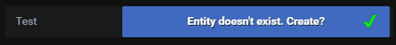
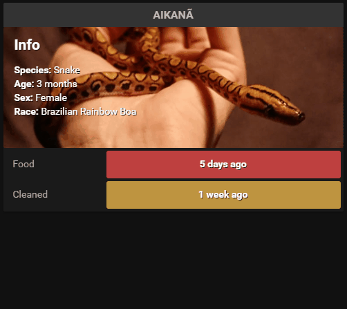

# check-button-card


## Description

Check Button Card is a button that tracks when it is last pressed, for the Home Assistant Lovelace front-end using MQTT auto discovery.

### Features
- Shows how long ago you've pressed the button.
- Automatic sensor configuration using Home Assistant MQTT discovery.
- Hold button to set custom time.
- Undo unwanted changes.
- Publishes visibility attribute for use with conditional cards.
- Possible to change button state by publishing to the topic with automations (Node-Red, etc).

## Installation
Requires a working MQTT setup with discovery enabled in Home Assistant. For more information check out the Home Assistant [documentation](https://www.home-assistant.io/docs/mqtt/discovery/).

The card will start in configuration mode and prompt you to create the MQTT config required for auto discovery. If the entity doesn't exist it will be created with the entity provided in the card config. After the button is configured the sensor will show up in your Home Assistant entity list and is used by the card to track the last button press.

The visibility timeout can be used in combination with a conditional card to show and hide items on the front-end. This requires custom automation to achieve (I personally use Node-Red for this).


## MQTT

It is possible to publish to the MQTT topic using automations to update the button state using physical buttons for example (instead of using the UI button).

The payload should be published to the relevant sensor. If you sensor is named `sensor.test_button` the topic should be `homeassistant/sensor/test_button/state`. For more information check out the Home Assistant [documentation](https://www.home-assistant.io/docs/mqtt/discovery/). 

### Payload Example
``` json
{"timestamp":"**timestamp here**","visibility_timeout":"2 hours","visible":true,"unit_of_measurement":"timestamp"}
```
### Node Red Example
```
// Define entity_id
const entityId = "sensor.test_button";

// Get global object
const haObject = global.get("homeassistant");

// Get attributes object from entity
let payloadObject = haObject.homeAssistant.states[entityId].attributes;

// Get current timestamp in seconds
const currentTime = Math.trunc(Date.now()/1000);

// Modify timestamp in payloadObject.
payloadObject.timestamp = currentTime;

// Create string from object
msg.payload = JSON.stringify(payloadObject);

return msg;
```

## Options

| Name | Type | Default | Description
| ---- | ---- | ------- | -----------
| type | string | **Required** | `custom:check-button-card`
| entity | string | **Required** | Sensor entity used to create and publish to.
| title | string | none | Title displayed next to the button.
| title_position | string | left | Sets the position of the title `left`,`inside`.
| visibility_timeout | string | none | Attribute added to entity for use in automation.
| undo_timeout | number | 15 | Time until undo button times out in seconds.
| hue | number | 220 | Changed the color hue of the bar `0`-`360`.
| saturation | string | 50% | Scales saturation of the button.
| height | string | 40px | Scales the height of the button.
| width | string | 70% | Scales the width of the button.
| severity | object | none | A list of severity values. Can use `* minutes`,`* hours`,`* days`, `* months`,`* years`
| card_style | object | none | A list of CSS styles applied to the card background.
| button_style | object | none | A list of CSS styles applied to the button.
| title_style | object | none | A list of CCS styles applied to the title.
| remove | boolean | false | Set to `true` for removal config mode. Used to remove entity from MQTT discovery.
| discovery_prefix | string | homeassistant | Define custom MQTT discovery prefix.
| **Localization** |
| displayTextYear | string | year | Custom Label for "year"
| displayTextYears | string | years | Custom Label for "years"
| displayTextMonth | string | month | Custom Label for "month"
| displayTextMonths | string | months | Custom Label for "months"
| displayTextWeek | string | week | Custom Label for "week"
| displayTextWeeks | string | weeks | Custom Label for "weeks"
| displayTextDay | string | day | Custom Label for "day"
| displayTextDays | string | days | Custom Label for "days"
| displayTextHour | string | hour | Custom Label for "hour"
| displayTextHours | string | hours | Custom Label for "hours"
| displayTextMinute | string | minute | Custom Label for "minute"
| displayTextMinutes | string | minutes | Custom Label for "minutes"
| displayTextLessThan1 | string | less than 1 | Custom Label for "less than 1"
| displayTextTimeAgo | string | ago | Custom Label for "ago"

## Default

```yaml
- type: custom:check-button-card
  title: Default
  entity: sensor.test_button
```
## Severity

```yaml
- type: custom:check-button-card
  title: Severity
  entity: sensor.test_button
  severity:
  - value: 5 minutes
    hue: '120'
  - value: 10 minutes
    hue: '40'
  - value: 20 minutes
    hue: '0'
```

## Links

[Home Assistant Community Topic](https://community.home-assistant.io/t/lovelace-check-button-card/92980)
